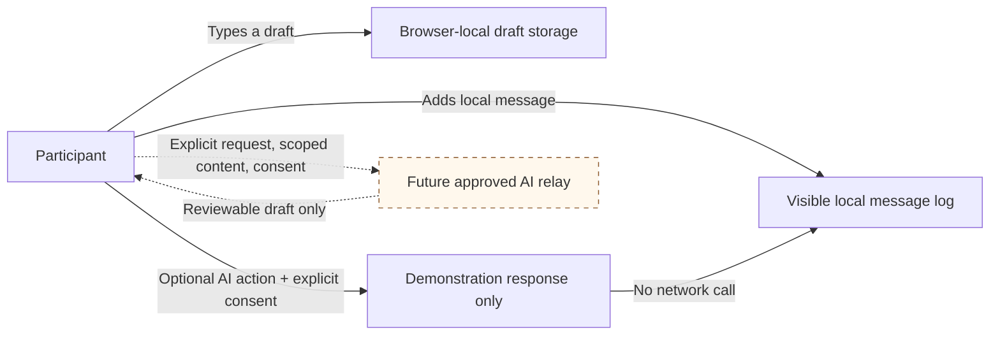

# Hearthline Bootstrap Shell

## Purpose

Hearthline is a demonstration-only, static foundation for a community-oriented
chat interface. It is designed around human-to-human conversation, with
optional AI facilitation that is scoped to explicit user action.

The shell does not implement authentication, persistence, federation,
moderation decisions, model inference, analytics, or network-based message
delivery. It must not be represented as a production social service.

## Core invariants

1. Human participation does not require AI use.
2. AI assistance is off by default and requires an explicit local consent choice.
3. AI output is a reviewable draft, not a decision, authority, or social signal.
4. No message, identity, communication style, device attribute, accessibility
   preference, self-description, or voluntary CyberRank personal-layer context
   may be used for ranking, eligibility, verification, or automated access
   decisions.
5. A participant must be able to communicate and obtain human clarification
   without disclosing medical, neural, biometric, physiological, credential,
   security, companion-system, telemetry, or institutional details.
6. AI-assisted summarization must be consent-based and limited to the selected
   content and stated purpose.
7. The client must not add third-party telemetry, tracking pixels, analytics,
   or remote AI endpoints without documented purpose, minimal disclosure,
   retention, security review, and an explicit approval gate.
8. Local drafts may be stored only in the browser selected by the participant.
   The user must be able to clear that draft.

## Demonstration data flow



## Future integration boundary

A production integration should expose a small, consent-aware interface rather
than embedding model-vendor logic throughout the user interface.

```ts
export type AiAction = "clarify" | "translate" | "consent_summary";

export interface AiAssistanceRequest {
  action: AiAction;
  requestId: string;
  purpose: string;
  participantSelectedText: string;
  consent: {
    grantedAt: string;
    scope: "single-request";
    revocable: true;
  };
  retention: {
    requestedMaximum: "ephemeral";
    trainingUseAllowed: false;
  };
}

export interface AiAssistanceDraft {
  requestId: string;
  content: string;
  generatedAt: string;
  reviewRequired: true;
  decisionUseProhibited: true;
}
```

The future relay must:

- Authenticate the requesting session without treating identity as a social rank.
- Use an allowlisted `wss://` endpoint in production.
- Validate WebSocket handshake origins.
- Set message-size limits, rate limits, idle timeouts, and structured error
  handling.
- Validate all inputs and render all received text as text rather than trusted
  HTML.
- Permit accessible human fallback, correction, and appeal.
- Record privacy-preserving operational events without storing chat contents
  unless separately and explicitly authorized.
- Provide a visible disclosure of the model/provider, purpose, retention,
  deletion route, and whether submitted data is used for training.

## Accessibility requirements

- The message history uses `role="log"` and `aria-live="polite"` so new
  nonurgent messages may be announced without stealing focus.
- Participants can pause message announcements.
- Keyboard users can reach the conversation through a skip link and submit a
  message with Control/Command + Enter.
- Visible focus indicators are retained.
- A high-contrast preference can be selected locally.
- Reduced-motion preferences are respected.
- AI controls explain when they are demonstration-only and when no content is
  transmitted.

## Security posture

The `index.html` demonstration includes a deliberately restrictive
Content-Security-Policy:

```text
default-src 'self';
base-uri 'none';
form-action 'self';
frame-ancestors 'none';
img-src 'self' data:;
object-src 'none';
script-src 'self';
style-src 'self';
connect-src 'self';
upgrade-insecure-requests
```

When a reviewed service endpoint is added, replace `connect-src 'self'` with a
minimal explicit allowlist. Do not use a broad `https:` or `wss:` scheme
allowlist, and do not introduce remote scripts merely for analytics or model
integration.

## Deployment notes

Serve the directory over HTTPS with response headers enforced by the deployment
platform. A `<meta http-equiv="Content-Security-Policy">` is included only as a
static-shell safeguard; the final policy belongs in HTTP response headers.

Before production use, add:

1. A privacy notice and a data-processing inventory.
2. Consent receipt and revocation mechanisms.
3. Human moderation and accessible grievance workflows.
4. End-to-end or appropriately scoped transport and storage protections.
5. Abuse resistance, rate limiting, reporting, and repair processes.
6. Independent accessibility testing with assistive-technology users.
7. Security review of authentication, authorization, real-time transport,
   moderation tooling, AI relay behavior, and retention enforcement.
